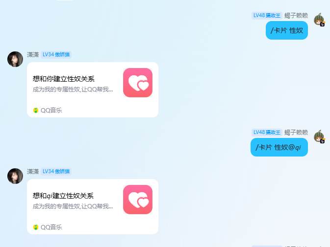

# AstrBot 恶搞关系卡片插件 (Fake Card Plugin)

专为 [AstrBot](https://github.com/Soulter/AstrBot) 编写的娱乐互动插件。该插件通过构造特殊的音乐卡片（Custom Music Card），成功绕过 QQ 严格的图文 JSON 风控，能够在群聊或私聊中生成精美的“建立关系”邀请卡片。

## ✨ 效果



## 📦 安装方法

### 方法一：通过 AstrBot 插件市场安装（推荐）
在 AstrBot 的控制台或管理面板中，搜索 `astrbot_plugin_fake_card`
### 方法二：手动安装
1. 将本仓库克隆或下载到 AstrBot 的 `data/plugins/` 目录下。
2. 确保文件夹名称与插件主类所要求的包名一致。
3. 重启 AstrBot。

## 🚀 使用说明

本插件目前仅支持在 **QQ (aiocqhttp)** 平台下使用。

**基础语法**：
`/卡片 <关系名> [目标用户]`

### 使用示例

**1. 艾特好友（推荐）**
```text
/卡片 父子 @小明
```
*效果：发送一张标题为“想和小明建立父子关系”的卡片。*

**2. 纯文本指定名字**
```text
/卡片 主仆 张三
```
*效果：发送一张标题为“想和张三建立主仆关系”的卡片。*

**3. 不指定特定人（缺省用法）**
```text
/卡片 小狗
```
*效果：发送一张标题为“想和你建立小狗关系”的卡片。*

## ⚠️ 注意事项

1. 本插件依赖 QQ 的 `aiocqhttp` 协议适配，在微信、Kook 等其他平台使用时会提示不支持。
2. 卡片中的跳转链接和图标使用了默认的静态资源，主要用于娱乐展示，点击不会产生实质性绑定。
3. 请适度使用，避免在严肃群组内频繁刷屏。

## 📄 开源协议

MIT License
